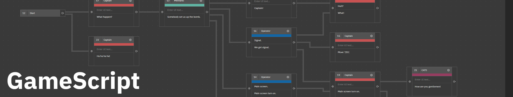

 
# GameScript Documentation
Short Sleeve Studio uses this repository to host the following for GameScript:
1. [A wiki](https://github.com/ShortSleeveStudio/GameScriptDocumentation/wiki) with all of our documentation.
2. [An issues section](https://github.com/ShortSleeveStudio/GameScriptDocumentation/issues) where you can file bugs.
3. [A discussions section](https://github.com/ShortSleeveStudio/GameScriptDocumentation/discussions) where you can ask questions and have discussions.

### Links
- [GameScript Store](https://github.com/ShortSleeveStudio/GameScriptDocumentation)
- [Unity Plugin](https://github.com/ShortSleeveStudio/GameScriptUnity)
- [Short Sleeve Studio](https://www.shortsleeve.studio/gamescript)

### License
GameScript is proprietary, but this repository it not.
